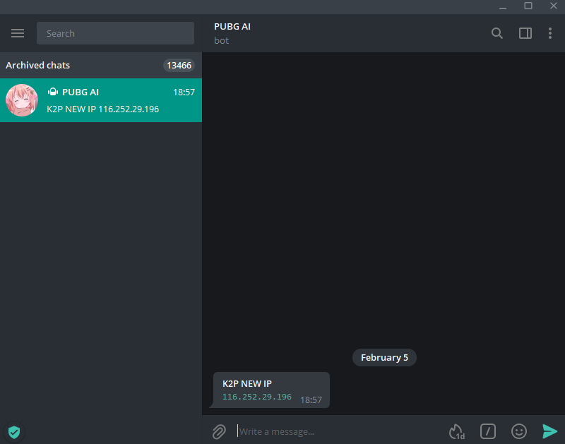
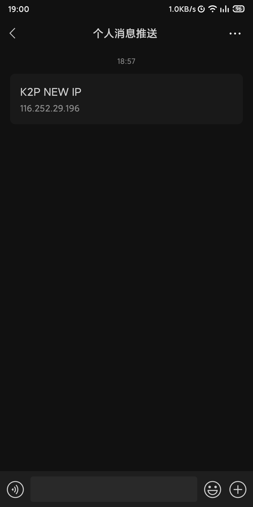

# Shell Push

## Pure Shell Impl of Wechat and Telegram Push Service

### Telegram



### Wechat



### How to Use

1. Fill `data/config.sh`, following instruction links in the file
2. If you have a router running `pppoe`, wanting to accept IP change notification
    1. For OpenWrt users, upload the whole project to `/usr/local/etc/`, `cd` the project folder, then run `./openwrt.sh`
    2. For Padavan users, upload the whole project to `/etc/storage/`, `cd` the project folder, then run `./padavan.sh`
    3. Other devices users, upload the whole project to `/root`, `cd` the project folder, then run

       ```shell
       printf "%s\n%s" "$(crontab -l)" "*/5 * * * * '$(pwd)'/main.sh" | crontab -
       ```

3. If you want to accept custom notifications, modify `main.sh`, here are some APIs for you to use

    | Function          | Arg1               | Arg2                     |
    | ----------------- | ------------------ | ------------------------ |
    | `wx_send_message` | Notification Title | Notification Description |
    | `tg_send_message` | Notification Title | Notification Description |

    For example

    ```shell
    wx_send_message "XX Service Is Down" "error message"
    ```
